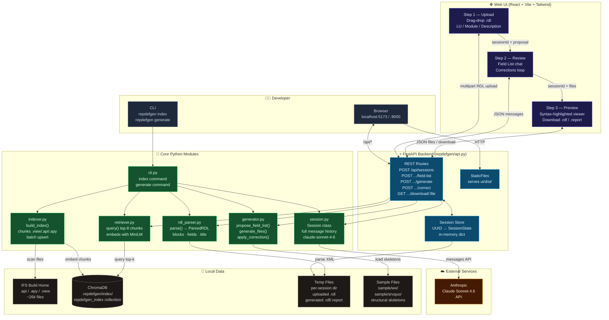

# RepDefGen Architecture



## Component Summary

| Component | Role |
|-----------|------|
| **React UI** | Three-step wizard — upload, field list review (chat), preview & download |
| **FastAPI** | Thin HTTP wrapper; holds session state; routes calls to core modules |
| **rdl_parser** | Extracts report name, block hierarchy, field names from `.rdl` XML |
| **retriever** | Embeds query with MiniLM; fetches top-8 chunks from ChromaDB |
| **generator** | Builds prompts; calls Claude for field list, file generation, corrections |
| **session** | Wraps Anthropic SDK; maintains full conversation history across all phases |
| **indexer** | Scans Build Home; chunks `.view` at column level, `.api/.apy` at proc level; upserts to ChromaDB |
| **ChromaDB** | Local vector store at `.repdefgen/index/`; `all-MiniLM-L6-v2` embeddings |
| **Claude Sonnet 4.6** | Proposes field lists, generates `.rdf` + `.report`, applies corrections |

## Data Flow — Generate Workflow

```
.rdl file
    │
    ▼
rdl_parser ──► ParsedRDL (report_name, blocks, visible fields)
    │
    ▼
retriever ──► ChromaDB query ──► top-8 relevant code chunks
    │
    ▼
generator.propose_field_list ──► Claude ──► Field List proposal
    │
    ▼
[developer reviews, corrects in chat loop]
    │
    ▼
generator.generate_files ──► Claude (8192 tokens) ──► .rdf + .report content
    │
    ▼
[developer applies SQL corrections]
    │
    ▼
generator.apply_correction ──► Claude ──► updated .rdf
    │
    ▼
Download .rdf  +  .report
```
